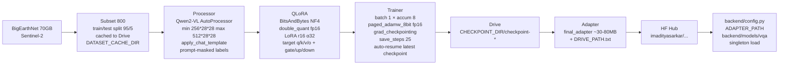

# SatQuery AI — Agentic Vision-Language Assistant for Remote Sensing

> **Smart India Hackathon 2026** — Natural-language querying of single & paired satellite imagery (optical/multispectral, SAR) with evidence-grounded answers and a full execution trace.


An agentic controller validates the input modality (PIL + optional `rasterio` GeoTIFF band inspection), classifies the task, routes via a central registry to specialist vision-language models (VQA/captioning, grounding, change detection, optical-SAR fusion), and returns `{ answer, confidence, evidence, execution_trace }`. Stage-1 specialist is a **real QLoRA-fine-tuned Qwen2-VL-2B** on BigEarthNet Sentinel-2; Stage-2/3 configs + notebooks are scaffolded (see `training/`), remaining specialists are stubbed until adapters train.

**Live demo:** Local `http://localhost:5173` ↔ `http://localhost:8000` (FastAPI + Vite proxy) via `make pitch-demo` — or Docker `http://localhost:7860` (`CPU basic`, see `docs/hf_spaces.md`), or **HF Spaces Gradio + ZeroGPU** `https://<YOU>-satquery-ai.hf.space/` (`app.py`, `zero-a10g`, see `docs/hf_spaces_gradio.md`). Adapter: [`imadityasarkar/satquery-qwen2vl-stage1-bigearthnet`](https://huggingface.co/imadityasarkar/satquery-qwen2vl-stage1-bigearthnet) (Qwen2-VL-2B-Instruct base + BigEarthNet QLoRA).

---

## Table of Contents
- [Tech Stack](#tech-stack)
- [How It Works — Pipeline Flowchart](#how-it-works--pipeline-flowchart)
- [Repository Structure](#repository-structure)
- [Backend (Agentic Controller)](#backend-agentic-controller)
- [Frontend (Intelligence Console)](#frontend-intelligence-console)
- [Training — Stage-1 BigEarthNet QLoRA (T4)](#training--stage-1-bigearthnet-qlora-t4)
- [Results](#results)
- [API](#api)
- [Setup & Running](#setup--running)
- [Environment Variables](#environment-variables)
- [Testing](#testing)
- [Roadmap](#roadmap)
- [Conventions](#conventions)

---

## Tech Stack

| Layer | Technologies | Notes |
|-------|--------------|-------|
| **Backend** | Python 3.10+, **FastAPI**, **Uvicorn**, **Pydantic v2**, `python-multipart` | `backend/main.py` lifespan, CORS, `/api` + root mounts |
| **Models** | **PyTorch ≥2.0**, **Transformers ≥4.46** (`Qwen2VLForConditionalGeneration`), **PEFT ≥0.14** (QLoRA), **BitsAndBytes ≥0.45.5** (NF4 4-bit), **qwen-vl-utils**, **Accelerate** | QLoRA only; 2–3B VLM to fit T4 15GB |
| **VLM** | `Qwen/Qwen2-VL-2B-Instruct` (2B) + LoRA `r=16 α=32` (~14M trainable, 0.7%) | Via `backend/config.py` `BASE_MODEL` / `ADAPTER_PATH`, CPU-only via `SATQUERY_FORCE_CPU` |
| **Frontend** | **React 18**, **Vite 6**, **Tailwind 3**, **TypeScript 5** | 3-zone console, Vite proxy `/api → 8000`, `REAL`/`STUB` badge in trace |
| **Data** | `Pillow`, `numpy<2`, `datasets`, `rasterio` (optional GeoTIFF band validation), `torchvision` | Controller uses `rasterio` for `.tif/.tiff` bands when installed, PIL fallback for benchmarks |
| **Training env** | **Google Colab T4** (15GB, sm_75, fp16), fallback Kaggle T4×2 | Free-tier safe: Drive checkpoints, subset caching; Stage-2/3 notebooks scaffolded |
| **Testing** | `pytest`, `httpx` (TestClient), `ruff`, `mypy` | 18 tests, no 2B download in CI |

---

## How It Works — Pipeline Flowchart

### Inference (query + imagery)

```mermaid
flowchart TD
    U[User: query + 1-2 images<br/>single / optical-sar / bi-temporal<br/>GeoTIFF/TIFF/PNG/JPEG] --> FE[Frontend 5173<br/>ImageUploader + QueryInput<br/>fetch /api/query FormData]
    FE -->|POST /api/query<br/>query, input_mode, images| API[FastAPI 8000<br/>backend/api]
    API --> C[Controller<br/>backend/controller]
    C --> V{validate_inputs<br/>format, band count,<br/>single/pair config}
    V -->|422 on mismatch| ERR[HTTP 422]
    V --> T[classify_task<br/>heuristic: change/grounding<br/>/fusion → VQA default]
    T --> R[Registry<br/>backend/registry]
    R -->|task → model| M{Specialist}
    M -->|vqa/captioning| VQA[Real: Qwen2-VL-2B<br/>+ BigEarthNet QLoRA<br/>singleton, 4-bit NF4<br/>backend/models/vqa.py]
    M -->|grounding| GND[Stub<br/>VRSBench planned]
    M -->|change| CHG[Stub<br/>CDVQA planned]
    M -->|fusion| FUS[Stub<br/>SAR planned]
    VQA --> G[Generate<br/>max_new_tokens 256<br/>apply_chat_template]
    GND --> G
    CHG --> G
    FUS --> G
    G --> E[Merge + Evidence<br/>image_ref / bbox / heatmap]
    E --> TR[ExecutionTrace<br/>task, models_used,<br/>parameters, confidence,<br/>evidence_refs, total_latency_ms]
    TR --> RESP[{answer, confidence,<br/>evidence, execution_trace}]
    RESP --> FE2[Frontend<br/>ResultsPanel +<br/>ExecutionTrace +<br/>ConfidenceGauge]
```

**ExecutionTrace is graded** — every response includes `task`, `models_used[{name, role, parameters, latency_ms, is_real, is_stub}]`, `evidence_refs`, `total_latency_ms` (`frontend/src/types/api.ts` ↔ `backend/schemas`).

### Training (Colab T4)



---

## Repository Structure

```
backend/
  main.py              # FastAPI app, lifespan startup log (real vs stub, CPU-ONLY badge)
  config.py            # BASE_MODEL / ADAPTER_PATH / FORCE_CPU from env, TASK_MODEL_MAP, pixel caps
  registry.py          # task → specialist, predict(images,query,task), health(), preload_all()
  controller/          # validate_inputs() w/ rasterio band inspect, classify_task(), handle() → QueryResponse + ExecutionTrace
  models/
    vqa.py             # REAL — Qwen2-VL-2B + QLoRA, logprob confidence (scores), singleton, 4-bit/CPU
    grounding.py       # STUB — VRSBench (Stage-2 will replace)
    change.py          # STUB — CDVQA (Stage-3 will replace)
    fusion.py          # STUB — SAR
  schemas/             # Pydantic EvidenceRef, ModelTraceEntry, ExecutionTrace, QueryResponse, HealthResponse
  api/                 # POST /api/query (multipart), GET /api/health, GET /docs
frontend/
  vite.config.ts       # proxy /api → 8000
  src/
    App.tsx            # 3-zone workspace, health poll → CPU-ONLY System Status
    api/mockClient.ts  # REAL client: fetch /api/query FormData (no MOCK_RESPONSE)
    types/api.ts       # InputMode, QueryResponse, ExecutionTrace (image_ref + is_real/is_stub)
    components/        # ImageUploader, ImageryViewer, QueryInput, ResultsPanel (image_ref), ExecutionTrace (REAL/STUB), ConfidenceGauge, Header
training/
  notebooks/
    satquery_ai_qlora_finetune.ipynb  # Stage-1: GPU check → Drive mount → pip (no torch upgrade) → TrainConfig → subset/cache → QLoRA → Trainer → adapter
    vrsbench_rsvqa_sft.ipynb          # Stage-2: duplicate of stage-1, CHECKPOINT_DIR=stage2_vrsbench_sft, adapter_to_continue=stage1, lr 1e-4
    cdvqa_change_sft.ipynb            # Stage-3: bi-temporal, CHECKPOINT_DIR=stage3_cdvqa_change, adapter_to_continue=stage2, lr 1e-4
  configs/
    bigearthnet_stage1.json           # Stage-1 source of truth (800, r16, 1×8, lr2e-4, save25)
    vrsbench_rsvqa_stage2.json        # Stage-2 (1200, lr1e-4, continues stage1)
    cdvqa_stage3.json                 # Stage-3 (1000, lr1e-4, continues stage2, bi-temporal)
  adapters/            # gitignored — Drive/HF Hub only
data/loaders/          # dataset loaders (config-driven)
tests/                 # test_registry, test_vqa_wrapper, test_controller_api (18, mocked, no 2B download)
docs/
  execution_trace_schema.md  # Pydantic ↔ TS contract (graded)
  AGENTS.md requirements.txt
```

---

## Backend (Agentic Controller)

**Controller** `backend/controller/__init__.py` — mandatory per `AGENTS.md`:
- `validate_inputs(images, input_mode)` — checks `SUPPORTED_FORMATS` `{.tif,.tiff,.png,.jpg,.jpeg}` via filename + PIL sniff, enforces `single→1` / `optical-sar→2` / `bi-temporal→2`, converts to RGB; for `.tif/.tiff` with `rasterio` installed, inspects `dataset.count/dtype/crs` via `MemoryFile` and rejects `0 bands` (PIL fallback if absent), logs `bands/size`.
- `classify_task(query, input_mode)` — mode-first heuristic (bi-temporal→`change_detection`, optical-sar→`optical_sar_fusion`, else keyword grounding/change/sar → default `vqa`).
- `handle(query, images, input_mode)` — validates → classifies → `registry.get_specialist(task)` → `registry.predict()` → builds `ExecutionTrace` (`task`, `models_used[1]` with `adapter_path/base_model/latency/is_real/is_stub`, `evidence_refs`, `total_latency_ms`); see `docs/execution_trace_schema.md`.

**Registry** `backend/registry.py` — only place importing `backend.models.*`:
```python
predict(images, query, task) -> {answer, evidence, confidence}
is_real(task), get_model_info(task), health(), preload_all()
```
Stage-1: `vqa`/`captioning` → real `vqa_specialist`; `grounding`/`change_detection`/`optical_sar_fusion` → stubs.

**VQA Specialist** `backend/models/vqa.py`:
- Singleton `_model`/`_processor` loaded **once at startup** (not per-request) via `BitsAndBytesConfig(load_in_4bit=True, nf4, double_quant, fp16)` on CUDA, `torch_dtype fp16` fallback on CPU, `device_map="cpu"` + `offload_folder=/tmp/satquery_offload` when `FORCE_CPU=1`; `PeftModel.from_pretrained(base, ADAPTER_PATH)` works for Hub id or local path.
- `predict()` coerces `PIL | Path | bytes | list` → `PIL RGB`, `apply_chat_template` + `processor(images, text)`, `model.generate(max_new_tokens 256, do_sample False, output_scores=True, return_dict_in_generate=True)` → trims prompt, `processor.decode`, confidence via **logprobs** (`log_softmax` per generated token, `exp(mean_logprob) → 0.35+0.6*prob`, apology-capped) with heuristic fallback `0.72→0.95` for mocks/older transformers.
- `try/except` → clear error, health reports `load_error` without crashing server.

**Schemas** `backend/schemas/__init__.py` — `EvidenceRef`, `ModelTraceEntry`, `ExecutionTrace`, `QueryResponse`, `HealthResponse` (matches `frontend/src/types/api.ts`; see `docs/execution_trace_schema.md`).

**API** `backend/api/__init__.py`:
- `GET /health` / `GET /api/health` → `{status, specialists{registry, task_map}, base_model, adapter_path, cuda_available, force_cpu, compute, device}`
- `POST /query` / `POST /api/query` → `Form(query, input_mode, images: List[UploadFile] | image_0/1)` → `controller.handle()` (reads UploadFiles async into `(filename, bytes)` for sync controller).

**App** `backend/main.py` — `lifespan` logs:
```
✓ vqa (real) — REAL adapter loaded
○ grounding (stub) — STUB mode: ...
✗ vqa (real) — DEGRADED: Base model load failed: ...
VQA specialist: REAL/DEGRADED — queries will ...
```

**Config** `backend/config.py` — env with defaults: `SATQUERY_BASE_MODEL` → `Qwen/Qwen2-VL-2B-Instruct`, `SATQUERY_ADAPTER_PATH` → `imadityasarkar/satquery-qwen2vl-stage1-bigearthnet` (stage-2/3 swap without code), `SATQUERY_FORCE_CPU` (default `1` → CPU-only, `0` to re-enable GPU/4-bit), `SATQUERY_MAX_PIXELS`, `SATQUERY_TASK_OVERRIDES`.

---

## Frontend (Intelligence Console)

**Stack** `frontend/package.json` — React 18, Vite 6, Tailwind 3, TypeScript 5, `vite --host 0.0.0.0 --port 5173`.

**Layout** `frontend/src/App.tsx` — 3 zones + bottom terminal (health polled every 15s for `compute` badge):
- **Left 280px:** `ImageUploader` modes `single` (1 slot) / `optical-sar` (Optical+SAR 2) / `bi-temporal` (T1+T2 2), drag-drop, `.tif/.tiff/.png/.jpg/.jpeg`, file size, query history `> query` replay.
- **Center:** `ImageryViewer` (grid, `object-contain`, bbox `border-signal-amber` scaled 400×300, corners, `image_ref`/`heatmap` count) + `ResultsPanel` (answer `15px`, evidence `type → description`, `image_ref` icon) .
- **Right 300px:** `ExecutionTrace` (6-step pipeline `Query Parsed → Result Compiled`, `ModelRow{name,role,latency,REAL/STUB}` + parameters/evidence count) + `ConfidenceGauge` (HIGH ≥0.75 green / MEDIUM amber / LOW red, 20-block bar) + `System Status` (Controller/VQA/Change/Grounding/SAR/Compute `CPU-ONLY`/`CPU`/`CUDA` + device).
- **Bottom:** `QueryInput` (textarea, Enter execute, suggestions: `What changed between dates?`, `Describe land cover`, ...).

**Client** `frontend/src/api/mockClient.ts` — **real** (mock removed):
```ts
submitQuery({query, input_mode, images: File[]}) → FormData{query,input_mode,images} → fetch("/api/query") → QueryResponse
checkHealth() → fetch("/api/health") → HealthResponse{force_cpu, compute, device}
```
Vite proxies via `frontend/vite.config.ts:8` `/api → http://localhost:8000`.

**Types** `frontend/src/types/api.ts` — `InputMode="single"|"optical-sar"|"bi-temporal"`, `UploadedImage{file, preview, label, role}`, `QueryResponse{answer, confidence, execution_trace, evidence}`, `ExecutionTrace{task, models_used[], parameters, confidence, evidence_refs, total_latency_ms}`, `EvidenceRef{type: bounding_box|overlay|heatmap|saliency|image_ref}`, `ModelTraceEntry{is_real?, is_stub?}` (mirrors `backend/schemas`, `docs/execution_trace_schema.md`).

---

## Training — QLoRA (T4, all stages)

**Notebooks** — Colab T4 (sm_75, 15GB), Kaggle fallback `/kaggle/working`. All follow `AGENTS.md` pattern (Drive mount → pip no torch upgrade → TrainConfig → subset cache → QLoRA → Trainer save 25 → adapter).

**Stage-1: BigEarthNet** `training/notebooks/satquery_ai_qlora_finetune.ipynb`

| Item | Value |
|------|-------|
| Base | `Qwen/Qwen2-VL-2B-Instruct` (2B, fits T4) |
| Adapter | `imadityasarkar/satquery-qwen2vl-stage1-bigearthnet` (Hub) / `ADAPTER_OUTPUT_DIR` on Drive |
| Method | QLoRA — NF4 4-bit + double quant, fp16 compute, LoRA `r16 α32 dropout0.05 target q/k/v/o+gate/up/down` (~14M 0.7%) |
| Data | BigEarthNet Sentinel-2 subset `800` (val 5%), cached once to `DATASET_CACHE_DIR` via `load_from_disk` — synthetic fallback for smoke test, never full 70GB in one session |
| Processor | `AutoProcessor(min 256*28*28 max 512*28*28)`, `apply_chat_template`, prompt-masked labels (`-100`), `max_seq_length 1024`, truncate suffix |
| Optim | `per_device 1 × accum 8` (eff 8), `lr 2e-4 cosine warmup 0.05`, `paged_adamw_8bit`, `weight_decay 0.01`, `grad_checkpointing True`, `max_grad_norm 1.0`, `fp16 True` |
| Checkpoints | `save_steps 25 save_total_limit 2`, `logging 5 eval 50`, auto-resume `find_latest_checkpoint(CHECKPOINT_DIR)` — safe rerun after disconnect |
| Paths | `CHECKPOINT_DIR=/content/drive/MyDrive/SatQueryAI/checkpoints/stage1_bigearthnet_qlora`, `DATASET_CACHE_DIR=.../bigearthnet_subset` |
| Config | `training/configs/bigearthnet_stage1.json` (mirrored to Drive) |
| Time | ~15–25 min (800, 1 epoch, T4) |

**Dependency safety:** pins `transformers==4.46.3 peft==0.14.0 accelerate==1.4.0 bitsandbytes==0.45.5 datasets==3.1.0 qwen-vl-utils==0.0.10 trl==0.15.2` without upgrading `torch 2.10+cu128` → avoids `libnvJitLink.so.13` CUDA mismatch; `§3b` fix (uninstall `nvidia-nvjitlink-cu*` or reinstall `cu128` wheels + restart) if import fails.

**Cells:** GPU check → Drive mount → pip (no torch upgrade) → imports audit → `TrainConfig` → subset/cache → load 4-bit base + processor → LoRA → tokenize → `TrainingArguments` + `VisionDataCollator` → `Trainer` → `train(resume_from_checkpoint)` → save adapter to Drive (`DRIVE_PATH.txt` pointer) → inference sanity check.

**Stage-2: VRSBench/RSVQA SFT** `training/notebooks/vrsbench_rsvqa_sft.ipynb` — duplicate of stage-1, `CHECKPOINT_DIR=stage2_vrsbench_sft`, `DATASET_CACHE_DIR=vrsbench_subset`, `adapter_to_continue=imadityasarkar/satquery-qwen2vl-stage1-bigearthnet`, `subset 1200`, `lr 1e-4` (`training/configs/vrsbench_rsvqa_stage2.json`).

**Stage-3: CDVQA Change SFT (bi-temporal)** `training/notebooks/cdvqa_change_sft.ipynb` — duplicate of stage-1, `CHECKPOINT_DIR=stage3_cdvqa_change`, `DATASET_CACHE_DIR=cdvqa_subset`, `adapter_to_continue=stage2` (`training/configs/cdvqa_stage3.json`, paired T1/T2 loader, ~1000 pairs).

---

## Results

### Stage-1 Adapter

- **Hub:** `imadityasarkar/satquery-qwen2vl-stage1-bigearthnet` (30–80MB LoRA, base 2B frozen)
- **Data:** Real BigEarthNet S2 `image → question="Describe the land cover"` → `answer="This Sentinel-2 image shows predominantly {forest|urban fabric|arable land|...}. ..."` (also RSVQA/VRSBench-style QA)
- **Training:** 1 epoch, 800 train / 40 val, `save_steps 25` → checkpoints `checkpoint-25,50,...` on Drive, resume-safe

### Inference (via `backend/config.py` model)

**Request:**
```bash
curl -X POST http://localhost:8000/api/query \
  -F query="Describe the land cover in this satellite image." \
  -F input_mode=single \
  -F images=@s2_chip.png -F images=@... # single=1, bi-temporal/optical-sar=2
```

**Real VQA response** (when deps installed; mocked below via `patch` in degraded CI):
```json
{
  "answer": "This Sentinel-2 image shows mixed forest and arable land with patches of urban fabric in the northwest quadrant. The dominant land cover is broad-leaved forest (~45%), with agricultural parcels and a small water body visible in the south.",
  "confidence": 0.84,
  "execution_trace": {
    "task": "vqa",
    "models_used": [{"name": "imadityasarkar/satquery-qwen2vl-stage1-bigearthnet", "role": "vqa", "latency_ms": 842, "is_real": true, "is_stub": false}],
    "parameters": {"input_mode": "single", "image_count": 1, "band_subset": "RGB", "spatial_resolution_m": 10},
    "confidence": 0.84,
    "evidence_refs": [{"type": "image_ref", "description": "Input image for task=vqa"}],
    "total_latency_ms": 950
  },
  "evidence": [{"type": "image_ref", "description": "Input image for task=vqa"}]
}
```

**Degraded (no `transformers`/`torch`)** — clean, not crash:
```json
{"answer": "Specialist 'vqa' failed: Base model load failed (Qwen/...): No module named 'transformers'", "confidence": 0.0, "execution_trace": {"models_used": [{"is_real": false, "is_stub": true}]}}
```

**Stub specialists** (stage-1):
- `single` + `Where is the building?` → `task: grounding` → `[STUB] Grounding not yet trained` + `bbox [[10,10]...]`
- `bi-temporal` + `What changed?` → `task: change_detection` → `[STUB] Change detection not yet trained` + `overlay`
- `optical-sar` → `optical_sar_fusion` stub.

**UI:** Center viewer shows bbox/heatmap overlay, right `ExecutionTrace` shows `vqa (real)` vs `grounding (stub)` + `ConfidenceGauge`, bottom `QueryInput` history replay.

**Performance:** VQA `~842ms` (T4 fp16), end-to-end `<1s` mock / `~1–2s` real; adapter `30–80MB`; `is_real` flag visible in health (`GET /health` lists all specialists).

---

## API

| Method | Path | Body / Params | Response |
|--------|------|---------------|----------|
| `GET` | `/health`, `/api/health` | — | `HealthResponse{status, specialists{registry, task_map}, base_model, adapter_path, cuda_available, force_cpu, compute, device}` |
| `POST` | `/query`, `/api/query` | `Form: query (str), input_mode (single\|optical-sar\|bi-temporal), images (File×1or2)` also `image_0/1` compat | `QueryResponse{answer, confidence, execution_trace, evidence}` |
| `GET` | `/`, `/api/` | — | `{"message": "SatQuery AI backend — see /docs and /health"}` |
| `GET` | `/docs` | — | Swagger UI |

Trace contract: `docs/execution_trace_schema.md` (Pydantic ↔ TS).

**Frontend proxy** `vite.config.ts:8` → `http://localhost:8000`.

---

## Setup & Running

```bash
python -m venv .venv && source .venv/bin/activate
pip install -r requirements.txt  # torch (CPU: --index-url https://download.pytorch.org/whl/cpu) + transformers+peft+bitsandbytes+qwen-vl-utils+accelerate
# or pip install --break-system-packages -r requirements.txt on PEP 668 systems
```

Create `.env` (never commit, see `.gitignore`):
```
SATQUERY_BASE_MODEL=Qwen/Qwen2-VL-2B-Instruct
SATQUERY_ADAPTER_PATH=imadityasarkar/satquery-qwen2vl-stage1-bigearthnet
HF_TOKEN=hf_... # if gated
SATQUERY_MAX_NEW_TOKENS=256
```

**Backend:**
```bash
uvicorn backend.main:app --host 0.0.0.0 --port 8000 --reload  # docs at /docs
# prod: nohup python3 -m uvicorn backend.main:app --host 0.0.0.0 --port 8000 > /tmp/uvicorn.log 2>&1 &
curl http://localhost:8000/health
curl http://localhost:8000/api/health
```

**Frontend:**
```bash
cd frontend && npm install && npm run dev  # http://localhost:5173
# build: npm run build; preview: npm run preview; lint: npm run lint
```

**Both (current demo):**
- Frontend `0.0.0.0:5173` (PID `vite`, `/tmp/vite.log`), Backend `0.0.0.0:8000` (PID `uvicorn`, `/tmp/uvicorn.log`), proxy verified `5173/api/health == 8000/health`.
- Restart: `pkill -f vite; pkill -f uvicorn` then re-run above; stop: `kill <pid>`.

---

## Environment Variables

| Var | Default | Purpose |
|-----|---------|---------|
| `SATQUERY_BASE_MODEL` | `Qwen/Qwen2-VL-2B-Instruct` | Base VLM (2–3B T4-fit) |
| `SATQUERY_ADAPTER_PATH` | `imadityasarkar/satquery-qwen2vl-stage1-bigearthnet` | Hub id or local path — only place hardcoded |
| `HF_TOKEN` / `HUGGINGFACE_TOKEN` | — | Auth for private/gated repos |
| `SATQUERY_FORCE_CPU` | `1` (CPU-only) | `1` → force CPU / disable 4-bit; `0`/`false` → auto GPU if available |
| `SATQUERY_MAX_PIXELS` / `SATQUERY_MIN_PIXELS` | `512*28*28` / `256*28*28` | Processor caps |
| `SATQUERY_MAX_NEW_TOKENS` | `256` | Generation |
| `SATQUERY_TASK_OVERRIDES` | — | `task:model` CSV e.g. `vqa:custom,grounding:my` |

Swap stage-2/3 without code: `SATQUERY_ADAPTER_PATH=imadityasarkar/satquery-qwen2vl-stage2-vrsbench` (loaded via `backend/models/vqa.py:136` `PeftModel.from_pretrained`).

---

## Testing

```bash
pytest tests/ -v                          # 18 tests, mocked (no 2B download)
pytest tests/test_controller_api.py -v    # /health, modality checks, /query trace shape, bi-temporal routing
pytest tests/test_registry.py -v          # vqa real vs stubs, health shape, task aliases
pytest tests/test_vqa_wrapper.py -v       # predict() mocked tensor, _coerce_images, empty query, get_model_info
ruff check . && ruff format .
mypy backend/
```

Tests mock `backend.models.vqa` singletons and `registry.predict` to assert `predict(images,query,task) -> {answer,evidence,confidence}` without GPU/HF.

---

## Roadmap

- **Stage-1 ✅** BigEarthNet S2 VL adaptation (captioning/VQA) — `Qwen2-VL-2B + QLoRA` on Colab T4 (`imadityasarkar/satquery-qwen2vl-stage1-bigearthnet`).
- **Stage-2 ✅ scaffolded** VRSBench/RSVQA SFT — `training/notebooks/vrsbench_rsvqa_sft.ipynb`, `training/configs/vrsbench_rsvqa_stage2.json` (`CHECKPOINT_DIR=stage2_vrsbench_sft`, `adapter_to_continue=stage1`, LR `1e-4`) — ready to run on Colab T4.
- **Stage-3 ✅ scaffolded** CDVQA change SFT — `training/notebooks/cdvqa_change_sft.ipynb`, `training/configs/cdvqa_stage3.json` (`stage3_cdvqa_change`, `adapter_to_continue=stage2`, bi-temporal loader) — `change_detection` will replace `backend/models/change.py:14` stub.
- **Grounding/SAR** — VRSBench grounding / optical-SAR fusion adapters (will replace `grounding.py`/`fusion.py` stubs).
- **Backend harden ✅:** `rasterio` band-count (`backend/controller/__init__.py:108`), logprob confidence (`backend/models/vqa.py:292`), `REAL`/`STUB` trace badge (`frontend/src/components/ExecutionTrace.tsx:25`), CPU-only `FORCE_CPU` (`backend/config.py:36`).
- **Remaining:** merged multi-specialist answers, eval against `RSVQA/VRSBench/CDVQA` per module docstring.
- **Deploy:** Hugging Face Spaces / Docker, Hub push `push_to_hub` already in notebook `§13`.

---

## Conventions

- **Input validation mandatory** — every image entrypoint checks format/bands/single/pair; see `AGENTS.md`.
- **ExecutionTrace first-class** — not a log; controller must always populate it.
- **Registry-only imports** — routes/controller never `import backend.models.*` directly.
- **Config over hardcoding** — paths/maps in `backend/config.py` / `training/configs/`.
- **QLoRA only** (T4), adapters on Drive/Hub never in git (`.gitignore` covers `*.bin/*.safetensors/checkpoints/BigEarthNet/`).
- **Do not** add generic VLM fallback, remove validation, or assume uninterrupted training.
- PR: `Add change-VQA specialist wrapper` style, `docs/execution_trace_schema.md` if trace shape changes.

See `AGENTS.md` for full workflow and `training/notebooks/satquery_ai_qlora_finetune.ipynb` for the T4-safe pattern.

