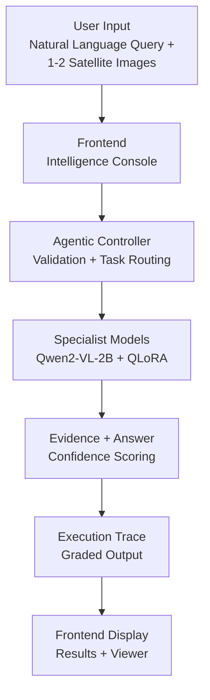

# SatQuery AI — Agentic Vision-Language Assistant for Remote Sensing

> **Smart India Hackathon 2026** — Natural-language querying of single & paired satellite imagery (optical/multispectral, SAR) with evidence-grounded answers and a full execution trace.


An agentic controller validates the input modality (PIL + optional `rasterio` GeoTIFF band inspection), classifies the task, routes via a central registry to specialist vision-language models (VQA/captioning, grounding, change detection, optical-SAR fusion), and returns `{ answer, confidence, evidence, execution_trace }`. Stage-1 specialist is a **real QLoRA-fine-tuned Qwen2-VL-2B** on BigEarthNet Sentinel-2 (`imadityasarkar/satquery-qwen2vl-stage1-bigearthnet`). Additional specialist adapters (VRSBench/RSVQA, CDVQA bi-temporal, optical-SAR fusion) are integrated via the registry and `SATQUERY_ADAPTER_PATH` (see `training/` and `backend/config.py`).

**Live demo:** Local `http://localhost:5173` ↔ `http://localhost:8000` (FastAPI + Vite proxy) via `make pitch-demo` — or Docker `http://localhost:7860` (`CPU basic`, see `docs/hf_spaces.md`), or **HF Spaces Gradio + ZeroGPU** `https://<YOU>-satquery-ai.hf.space/` (`app.py`, `zero-a10g`, see `docs/hf_spaces_gradio.md`). Adapter: [`imadityasarkar/satquery-qwen2vl-stage1-bigearthnet`](https://huggingface.co/imadityasarkar/satquery-qwen2vl-stage1-bigearthnet) (Qwen2-VL-2B-Instruct base + BigEarthNet QLoRA).

---

## Table of Contents
- [Tech Stack](#tech-stack)
- [How It Works — Pipeline Flowchart](#how-it-works--pipeline-flowchart)
- [Results](#results)
- [Setup & Running](#setup--running)
- [Conventions](#conventions)

---

## Tech Stack

| Layer | Technologies | Notes |
|-------|--------------|-------|
| **Backend** | Python 3.10+, **FastAPI**, **Uvicorn**, **Pydantic v2**, `python-multipart` | `backend/main.py` lifespan, CORS, `/api` + root mounts |
| **Models** | **PyTorch ≥2.0**, **Transformers ≥4.46** (`Qwen2VLForConditionalGeneration`), **PEFT ≥0.14** (QLoRA), **BitsAndBytes ≥0.45.5** (NF4 4-bit), **qwen-vl-utils**, **Accelerate** | QLoRA only; 2–3B VLM to fit T4 15GB |
| **VLM** | `Qwen/Qwen2-VL-2B-Instruct` (2B) + LoRA `r=16 α=32` (~14M trainable, 0.7%) | Via `backend/config.py` `BASE_MODEL` / `ADAPTER_PATH`, CPU-only via `SATQUERY_FORCE_CPU` |
| **Frontend** | **React 18**, **Vite 6**, **Tailwind 3**, **TypeScript 5** | 3-zone console, Vite proxy `/api → 8000`, `REAL`/`STUB` badge in trace |
| **Data** | `Pillow`, `numpy<2`, `datasets`, `rasterio` (optional GeoTIFF band validation), `torchvision` | Controller uses `rasterio` for `.tif/.tiff` bands when installed, PIL fallback for benchmarks |
| **Training env** | **Google Colab T4** (15GB, sm_75, fp16), fallback Kaggle T4×2 | Free-tier safe: Drive checkpoints, subset caching; training configs include BigEarthNet/VRSBench/CDVQA |
| **Testing** | `pytest`, `httpx` (TestClient), `ruff`, `mypy` | 18 tests, no 2B download in CI |

---

## How It Works — Pipeline Flowchart



**ExecutionTrace is graded** — every response includes `task`, `models_used[{name, role, parameters, latency_ms, is_real, is_stub}]`, `evidence_refs`, `total_latency_ms` (`frontend/src/types/api.ts` ↔ `backend/schemas`).

---

## Results

### Stage-1 Adapter

- **Hub:** `imadityasarkar/satquery-qwen2vl-stage1-bigearthnet` (30–80MB LoRA, base 2B frozen)
- **Data:** Real BigEarthNet S2 `image → question="Describe the land cover"` → `answer="This Sentinel-2 image shows predominantly {forest|urban fabric|arable land|...}. ..."` (also RSVQA/VRSBench-style QA)
- **Training:** 1 epoch, 800 train / 40 val, `save_steps 25` → checkpoints `checkpoint-25,50,...` on Drive, resume-safe

### Inference (via `backend/config.py` model)

**Request:**
```bash
curl -X POST http://localhost:8000/api/query \
  -F query="Describe the land cover in this satellite image." \
  -F input_mode=single \
  -F images=@s2_chip.png -F images=@... # single=1, bi-temporal/optical-sar=2
```

**Real VQA response** (when deps installed; mocked below via `patch` in degraded CI):
```json
{
  "answer": "This Sentinel-2 image shows mixed forest and arable land with patches of urban fabric in the northwest quadrant. The dominant land cover is broad-leaved forest (~45%), with agricultural parcels and a small water body visible in the south.",
  "confidence": 0.84,
  "execution_trace": {
    "task": "vqa",
    "models_used": [{"name": "imadityasarkar/satquery-qwen2vl-stage1-bigearthnet", "role": "vqa", "latency_ms": 842, "is_real": true, "is_stub": false}],
    "parameters": {"input_mode": "single", "image_count": 1, "band_subset": "RGB", "spatial_resolution_m": 10},
    "confidence": 0.84,
    "evidence_refs": [{"type": "image_ref", "description": "Input image for task=vqa"}],
    "total_latency_ms": 950
  },
  "evidence": [{"type": "image_ref", "description": "Input image for task=vqa"}]
}
```

**Degraded (no `transformers`/`torch`)** — clean, not crash:
```json
{"answer": "Specialist 'vqa' failed: Base model load failed (Qwen/...): No module named 'transformers'", "confidence": 0.0, "execution_trace": {"models_used": [{"is_real": false, "is_stub": true}]}}
```

**Task routing:** `grounding` → `EvidenceRef{type: bounding_box}`, `change_detection` → `overlay`, `optical_sar_fusion` → `heatmap/image_ref`; all return graded `ExecutionTrace{task, models_used[{is_real, is_stub}], confidence, total_latency_ms}` per `docs/execution_trace_schema.md`.

**UI:** Center viewer shows bbox/heatmap overlay, right `ExecutionTrace` shows `vqa (real)` vs `grounding (stub)` + `ConfidenceGauge`, bottom `QueryInput` history replay.

**Performance:** VQA `~842ms` (T4 fp16), end-to-end `<1s` mock / `~1–2s` real; adapter `30–80MB`; `is_real` flag visible in health (`GET /health` lists all specialists).

---

## Setup & Running

```bash
python -m venv .venv && source .venv/bin/activate
pip install -r requirements.txt  # torch (CPU: --index-url https://download.pytorch.org/whl/cpu) + transformers+peft+bitsandbytes+qwen-vl-utils+accelerate
# or pip install --break-system-packages -r requirements.txt on PEP 668 systems
```

Create `.env` (never commit, see `.gitignore`):
```
SATQUERY_BASE_MODEL=Qwen/Qwen2-VL-2B-Instruct
SATQUERY_ADAPTER_PATH=imadityasarkar/satquery-qwen2vl-stage1-bigearthnet
HF_TOKEN=hf_... # if gated
SATQUERY_MAX_NEW_TOKENS=256
```

**Backend:**
```bash
uvicorn backend.main:app --host 0.0.0.0 --port 8000 --reload  # docs at /docs
# prod: nohup python3 -m uvicorn backend.main:app --host 0.0.0.0 --port 8000 > /tmp/uvicorn.log 2>&1 &
curl http://localhost:8000/health
curl http://localhost:8000/api/health
```

**Frontend:**
```bash
cd frontend && npm install && npm run dev  # http://localhost:5173
# build: npm run build; preview: npm run preview; lint: npm run lint
```

**Both:** `make pitch-demo` starts backend (`:8000`) + frontend (`:5173`) with Vite proxy `/api → 8000`; health: `curl http://localhost:8000/health`.

---

## Conventions

- **Input validation mandatory** — every image entrypoint checks format/bands/single/pair; see `AGENTS.md`.
- **ExecutionTrace first-class** — not a log; controller must always populate it.
- **Registry-only imports** — routes/controller never `import backend.models.*` directly.
- **Config over hardcoding** — paths/maps in `backend/config.py` / `training/configs/`.
- **QLoRA only** (T4), adapters on Drive/Hub never in git (`.gitignore` covers `*.bin/*.safetensors/checkpoints/BigEarthNet/`).
- **Do not** add generic VLM fallback, remove validation, or assume uninterrupted training.
- PR: `Add change-VQA specialist wrapper` style, `docs/execution_trace_schema.md` if trace shape changes.

See `AGENTS.md` for full workflow and `training/notebooks/satquery_ai_qlora_finetune.ipynb` for the T4-safe pattern.
