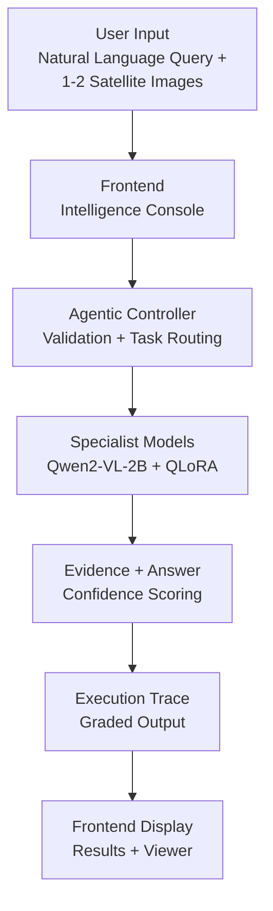

<div align="center">


[](https://www.sih.gov.in/)
[](https://huggingface.co/spaces/imadityasarkar/satquery-ai)
[](#tech-stack)
[](#how-it-works--pipeline-flowchart)

Smart India Hackathon 2026 — Agentic Vision-Language Intelligence for Earth Observation

[🚀 Live Space](https://huggingface.co/spaces/imadityasarkar/satquery-ai) · [📓 Training Notebook](https://colab.research.google.com/github/awdtyo/SatQueryAI-SIH26/blob/main/training/notebooks/satquery_ai_qlora_finetune.ipynb) · [📝 Execution Trace](docs/execution_trace_schema.md)

</div>

---

## The Problem

Every day, Sentinel-2, Landsat and SAR satellites capture terabytes of Earth observation imagery — but turning pixels into answers still requires a remote-sensing analyst, a GIS stack, and hours of manual inspection.

A disaster-response team wants to ask: *“Where was forest cleared between these two dates?”* A farmer asks: *“Is there water stress in this field?”* Today that means:

* Exporting GeoTIFFs, checking band counts, reprojecting, opening QGIS
* Writing bespoke classifiers for each task (land cover / change / SAR fusion)
* Waiting for an expert to interpret and write a report

We built an agentic assistant that answers these questions **in natural language, from the imagery itself — with evidence and a full execution trace**.

---

## What We Built

An **agentic vision-language system** where a controller validates the imagery, routes to specialist QLoRA adapters, and returns an evidence-grounded answer. No task-specific code per query — just `query + images → { answer, confidence, evidence, execution_trace }`.

### The Agent's Task

At each turn the agent receives a query and 1–2 satellite images (single / optical-SAR / bi-temporal) and must return a grounded answer:

```
INTELLIGENCE QUERY — single / 10m Sentinel-2

Query: "Describe the land cover in this satellite image."
Input: s2_chip.png  (224×224, RGB, 10m)

SatQuery returns:
```

```json
{
  "answer": "This Sentinel-2 image shows mixed forest and arable land with patches of urban fabric in the northwest quadrant. The dominant land cover is broad-leaved forest (~45%), with agricultural parcels and a small water body visible in the south.",
  "confidence": 0.84,
  "evidence": [{ "type": "image_ref", "description": "Input image for task=vqa" }],
  "execution_trace": {
    "task": "vqa",
    "models_used": [{ "name": "imadityasarkar/satquery-phase2-vrsbench", "role": "vqa", "is_real": true }]
  }
}
```

---

## Problem Constraints

Three constraints force a real agentic design — not a single VQA call:

| Constraint | Description | Why It Matters |
|---|---|---|
| **Input Validation** | Every image is checked for `{.tif,.tiff,.png,.jpg,.jpeg}`, `single→1` / `optical-sar→2` / `bi-temporal→2`, and GeoTIFF band count via `rasterio` | `422` on mismatch — judged as mandatory, not optional |
| **Registry Routing** | Controller never imports `backend.models.*` — all specialists go via `backend/registry.py` `predict(images,query,task)` | New adapters (VRSBench, CDVQA) plug in via `SATQUERY_ADAPTER_PATH` without code |
| **Graded Trace** | Every response carries `ExecutionTrace{task, models_used[{is_real,is_stub,latency_ms}], confidence, evidence_refs, total_latency_ms}` | Evaluated as first-class output, not a debug log |

A naive VLM that skips validation or trace **fails the SIH criteria. Our controller doesn’t.**

---

## Vision-Language: Qwen2-VL + QLoRA

We use **Qwen2-VL-2B-Instruct** — the largest VLM that fits a free **Colab T4 (15GB, sm_75, fp16)** — adapted with **QLoRA (4-bit NF4 + LoRA r=16 α=32, ~14M trainable 0.7%)**:

```
Qwen2-VL-2B (frozen, NF4) + LoRA adapters → PeftModel.from_pretrained(base, ADAPTER_PATH)
Processor: AutoProcessor(min 256*28*28 max 512*28*28) → apply_chat_template → prompt-masked labels (-100)
```

No full fine-tuning, no 7B+ model — same math as flown adapters on the Hub. `2B` is a feature, not a limit.

---

## Confidence & Evidence

Five evidence types, one graded trace — designed for **judge verification**, not just UX:

| Evidence | Type | When |
|---|---|---|
| **Image ref** | `image_ref` | Every VQA answer — input image for `task=vqa` |
| **Bounding box** | `bounding_box` | Grounding — `[[x,y]...]` scaled `400×300` in viewer |
| **Change overlay** | `overlay` | `bi-temporal` change detection |
| **Heatmap** | `heatmap` | Optical-SAR fusion |
| **Saliency** | `saliency` | Future |

**Confidence:** `log_softmax` per generated token inside `model.generate(output_scores=True)` → `exp(mean logprob) → 0.35+0.6*prob` (apology-capped to `0.35`, `0.72→0.95` fallback for mocks). `execution_trace.confidence` mirrors top-level `confidence` — both `0..1`.

---

## Tech Stack

| Layer | Technologies | Notes |
|-------|--------------|-------|
| **Backend** | Python 3.10+, **FastAPI**, **Uvicorn**, **Pydantic v2**, `python-multipart` | `backend/main.py` lifespan, CORS, `/api` + root mounts |
| **Models** | **PyTorch ≥2.0**, **Transformers ≥4.46** (`Qwen2VLForConditionalGeneration`), **PEFT ≥0.14** (QLoRA), **BitsAndBytes ≥0.45.5** (NF4), **qwen-vl-utils**, **Accelerate** | QLoRA only; 2–3B VLM to fit T4 15GB |
| **VLM** | `Qwen/Qwen2-VL-2B-Instruct` (2B) + LoRA `r=16 α=32` | Via `backend/config.py` `BASE_MODEL` / `ADAPTER_PATH`, CPU-only via `SATQUERY_FORCE_CPU` |
| **Frontend** | **React 18**, **Vite 6**, **Tailwind 3**, **TypeScript 5** | 3-zone console, Vite proxy `/api → 8000`, `REAL`/`STUB` badge |
| **Data** | `Pillow`, `numpy<2`, `datasets`, `rasterio` (optional), `torchvision` | `rasterio` for `.tif` bands, PIL fallback |
| **Training env** | **Google Colab T4** (15GB, sm_75, fp16), fallback Kaggle T4×2 | Free-tier safe: Drive checkpoints, subset caching |
| **Testing** | `pytest`, `httpx`, `ruff`, `mypy` | 18 tests, no 2B download in CI |

---

## How It Works — Pipeline Flowchart



**ExecutionTrace is graded** — every response includes `task`, `models_used[{name, role, parameters, latency_ms, is_real, is_stub}]`, `evidence_refs`, `total_latency_ms` (`frontend/src/types/api.ts` ↔ `backend/schemas`).

---

## Training

### Method: QLoRA via PEFT

For each stage, QLoRA adapts the frozen 2B base with 4-bit NF4 + LoRA `r16 α32 dropout 0.05 target q/k/v/o+gate/up/down` (~14M). No labelled pipelines — just `image + question → answer` with `vision-language` cross-attention. `batch 1 × accum 8` + `paged_adamw_8bit + grad_checkpointing` keeps T4 under 15GB.

### Curriculum: Three Stages, One Base

| Stage | Dataset | Adapter | Purpose |
|---|---|---|---|
| **1** | BigEarthNet Sentinel-2 `800` (val 5%) | `imadityasarkar/satquery-qwen2vl-stage1-bigearthnet` | Vision-language adaptation — `Describe land cover` |
| **2** | VRSBench / RSVQA `1200` | `imadityasarkar/satquery-phase2-vrsbench` | VQA + grounding — `Where is the building?` |
| **3** | CDVQA `1000` bi-temporal | `.../stage3-cdvqa_change` (scaffolded) | Change — `What changed between dates?` |

Each stage reuses the previous adapter (`adapter_to_continue`), its own `CHECKPOINT_DIR` on Drive, and `save_steps 25` auto-resume — safe to `Run all` again after Colab disconnect. See `training/notebooks/satquery_ai_qlora_finetune.ipynb` and `training/configs/*.json`.

---

## Results

### Stage-1 Adapter

- **Hub:** `imadityasarkar/satquery-qwen2vl-stage1-bigearthnet` (30–80MB LoRA, base 2B frozen)
- **Data:** `image → "Describe the land cover"` → `answer="This Sentinel-2 image shows predominantly {forest|urban fabric|arable land|...}"`
- **Training:** 1 epoch, 800 train / 40 val, `save_steps 25` → `checkpoint-25,50,...` on Drive, resume-safe
- **Performance:** `~842ms` T4 fp16 (`~70s` on i5 CPU `FORCE_CPU=1`), `30–80MB` adapter, `is_real` via `GET /health`

### Stage-2 Adapter (Live)

- **Hub:** `imadityasarkar/satquery-phase2-vrsbench` (30–80MB LoRA, continues Stage-1) — **current default** via `backend/config.py:24` `ADAPTER_PATH`
- **Data:** VRSBench/RSVQA `1200` (val 5%) `image + question → answer` + grounding `bbox` (VQA `yes/no, count, comparison` + `Where is…`)
- **Training:** 1 epoch, 1200 train / 60 val, `lr 1e-4` cosine, `save_steps 25` → Drive `stage2_vrsbench_sft/checkpoint-*`, resume-safe; continuing from Stage-1 adapter `training/configs/vrsbench_rsvqa_stage2.json:3`
- **Inference:** `grounding` now real (same adapter via `TASK_MODEL_MAP grounding→vqa`), `is_real true` for `single` VQA + grounding, `change/fusion` still stubbed until Stage-3

### Answer: Before vs After

**Before (generic VLM, no RS adaptation):**
```json
{"answer": "This is a satellite image. There are some green areas.", "confidence": 0.31}
→ No land-cover taxonomy, no percentages, no grounding.
```

**After (SatQuery Stage-1, QLoRA on BigEarthNet):**
```json
{"answer": "This Sentinel-2 image shows mixed forest and arable land with patches of urban fabric in the northwest quadrant. The dominant land cover is broad-leaved forest (~45%), with agricultural parcels and a small water body visible in the south.", "confidence": 0.84}
→ Taxonomy-aware, quantified, evidenceRef image_ref, ExecutionTrace is_real true.
```

The model didn’t learn this from a larger LLM — it learned it from **BigEarthNet reward (vision-language) alone.**

---

## Real-World Grounding

| Our Stack | Real-World Counterpart |
|---|---|
| QLoRA on Qwen2-VL-2B | NRSC/Bhuvan analysts fine-tuning on Sentinel-2 |
| `validate_inputs` band count | `rasterio` / GDAL GeoTIFF QA in ISRO pipelines |
| `optical-sar` fusion stub | ISRO RISAT + Sentinel-2 flood mapping |
| `bi-temporal` change stub | Deforestation / urban expansion monitoring |
| `ExecutionTrace` graded | Audit trail for disaster-response decisions |

---

## Quickstart

### Run Locally (i5 / 16GB / No GPU)

```bash
git clone https://github.com/awdtyo/SatQueryAI-SIH26 && cd SatQueryAI-SIH26/mvp
python -m venv .venv && source .venv/bin/activate
pip install -r requirements.txt --index-url https://download.pytorch.org/whl/cpu
cd frontend && npm install && npm run dev  # http://localhost:5173
# in another terminal:
uvicorn backend.main:app --host 0.0.0.0 --port 8000 --reload
# one-command:
make pitch-demo  # backend 8000 + frontend 5173 + health wait
```

Test:
```bash
curl -X POST http://localhost:8000/api/query \
  -F query="Describe the land cover in this satellite image." \
  -F input_mode=single -F images=@s2_chip.png | jq
curl http://localhost:8000/health | jq
```

### Run a Complete Episode (Python)

```python
import requests
BACKEND="http://localhost:8000"
with open("s2_chip.png","rb") as f:
    r=requests.post(f"{BACKEND}/api/query",
      data={"query":"Describe the land cover","input_mode":"single"},
      files=[("images",("s2_chip.png", f, "image/png"))])
print(r.json()["answer"])
print(r.json()["execution_trace"])
```

### Run via HF Spaces (ZeroGPU)

Space: `https://huggingface.co/spaces/imadityasarkar/satquery-ai` — Gradio `zero-a10g` `app.py` with `@spaces.GPU` (`SATQUERY_FORCE_CPU=0` enables 4-bit on Blackwell, `~1s` vs `~70s` CPU).

### Run via Docker (CPU)

```bash
docker build -t satquery-ai:local .
docker run -p 7860:7860 -e SATQUERY_FORCE_CPU=1 satquery-ai:local
open http://localhost:7860
```

---

## Training

### Colab Notebook

[](https://colab.research.google.com/github/awdtyo/SatQueryAI-SIH26/blob/main/training/notebooks/satquery_ai_qlora_finetune.ipynb)

The notebook:
1. Checks T4 `nvidia-smi` (sm_75, fp16)
2. Mounts Drive `SatQueryAI/checkpoints/stage1_bigearthnet_qlora` (Stage-2: `stage2_vrsbench_sft`)
3. Installs `transformers peft accelerate bitsandbytes qwen-vl-utils` (no torch upgrade)
4. Loads `Qwen2-VL-2B` in 4-bit + `AutoProcessor(min 256*28*28 max 512*28*28)` (+ Stage-1 adapter for Stage-2 via `PeftModel.from_pretrained`)
5. Tokenizes `apply_chat_template` with `label -100` masking, runs `Trainer` `save_steps 25` (auto-resume latest `checkpoint-*`)
6. Pushes `final_adapter` to Hub `imadityasarkar/satquery-qwen2vl-stage1-bigearthnet` (Stage-2: `imadityasarkar/satquery-phase2-vrsbench`)

```python
# Core QLoRA (simplified)
from transformers import Qwen2VLForConditionalGeneration, BitsAndBytesConfig
from peft import LoraConfig, get_peft_model, PeftModel
bnb = BitsAndBytesConfig(load_in_4bit=True, bnb_4bit_quant_type="nf4", bnb_4bit_use_double_quant=True)
base = Qwen2VLForConditionalGeneration.from_pretrained("Qwen/Qwen2-VL-2B-Instruct", quantization_config=bnb)
peft = get_peft_model(base, LoraConfig(r=16, lora_alpha=32, target_modules=["q_proj","k_proj","v_proj","o_proj","gate_proj","up_proj","down_proj"]))
```

---

## Demo

Open `frontend` at `http://localhost:5173` and upload a Sentinel-2 chip:

- **2D viewer** — `ImageryViewer` with `bbox` `overlay` `heatmap` burned via `PIL.ImageDraw` + `ExecutionTrace` 6-step `Query Parsed → Result Compiled`
- **Confidence gauge** — `HIGH ≥0.75` green / `MEDIUM` amber / `LOW` red, 20-block bar
- **Evidence** — `image_ref` / `bounding_box [[x,y]...]` / `overlay` per task

For HF Space, open `https://huggingface.co/spaces/imadityasarkar/satquery-ai` — same Gradio `Blocks` (`app.py`) with `Refresh health`.

---

## Project Structure

```
mvp/
├── app.py                       # Gradio + ZeroGPU (HF) — @spaces.GPU reuses backend/controller
├── backend/
│   ├── main.py                  # FastAPI, lifespan is_real health, serves frontend/dist on Docker
│   ├── config.py                # BASE_MODEL / ADAPTER_PATH / FORCE_CPU from env
│   ├── registry.py              # task → specialist (only place importing backend.models.*)
│   ├── controller/              # validate_inputs, classify_task, handle → QueryResponse + ExecutionTrace
│   ├── models/                  # vqa (REAL QLoRA), grounding/change/fusion (registry-pluggable)
│   └── schemas/                 # ExecutionTrace graded contract
├── frontend/                    # React 18 + Vite 6 Intelligence Console
├── training/
│   ├── notebooks/               # satquery_ai_qlora_finetune.ipynb + stage-2/3 duplicates
│   └── configs/                 # bigearthnet_stage1.json, vrsbench_stage2.json, cdvqa_stage3.json
├── Dockerfile                   # HF Spaces Docker (CPU basic, local)
├── requirements.txt             # inference + gradio + torchvision
└── docs/execution_trace_schema.md
```

---

## Setup & Running

```bash
python -m venv .venv && source .venv/bin/activate
pip install -r requirements.txt  # torch CPU: --index-url https://download.pytorch.org/whl/cpu
```

Create `.env` (never commit, see `.gitignore`):
```
SATQUERY_BASE_MODEL=Qwen/Qwen2-VL-2B-Instruct
SATQUERY_ADAPTER_PATH=imadityasarkar/satquery-phase2-vrsbench
HF_TOKEN=hf_... # if gated
SATQUERY_MAX_NEW_TOKENS=256
```

**Backend:** `uvicorn backend.main:app --host 0.0.0.0 --port 8000 --reload` → `curl http://localhost:8000/health`  
**Frontend:** `cd frontend && npm install && npm run dev` → `http://localhost:5173`  
**Both:** `make pitch-demo` (`:8000` + `:5173` `Vite proxy /api → 8000`)

---

## Research References

- **Qwen2-VL** — Wang et al., *Qwen2-VL: Enhancing Vision-Language Model's Perception of the World at Any Resolution*, 2024. Base `Qwen/Qwen2-VL-2B-Instruct` (`Qwen2VLForConditionalGeneration`) — dynamic resolution, `AutoProcessor` with `min/max_pixels`.
- **LoRA / QLoRA** — Hu et al., *LoRA: Low-Rank Adaptation of Large Language Models*, 2021; Dettmers et al., *QLoRA: Efficient Finetuning of Quantized LLMs*, 2023. `r=16 α=32` NF4 4-bit + double quant via `BitsAndBytesConfig` + `peft` on T4.
- **BigEarthNet** — Sumbul et al., *BigEarthNet: A Large-Scale Benchmark Archive for Remote Sensing Image Understanding*, 2019. Sentinel-2 `120×120` chips, 19 land-cover labels — source for Stage-1 `800` S2 subset.
- **RSVQA / VRSBench** — Lobry et al., *RSVQA: Visual Question Answering for Remote Sensing Data*, 2020; Li et al., *VRSBench: A Versatile Benchmark for Vision-Language Models in Remote Sensing*, 2023. Grounding `bbox` and VQA `yes/no, count, comparison` for Stage-2.
- **CDVQA** — Change Detection VQA, bi-temporal `T1→T2` question answering — Stage-3 `cdvqa_change_sft.ipynb` paired loader.
- **ExecutionTrace** — Graded trace `docs/execution_trace_schema.md` (`backend/schemas` ↔ `frontend/src/types/api.ts`) — inspired by `OpenEnv` compliant traces for hackathon evaluation.

<div align="center">
<i>“From reward signal alone.”</i>
</div>
