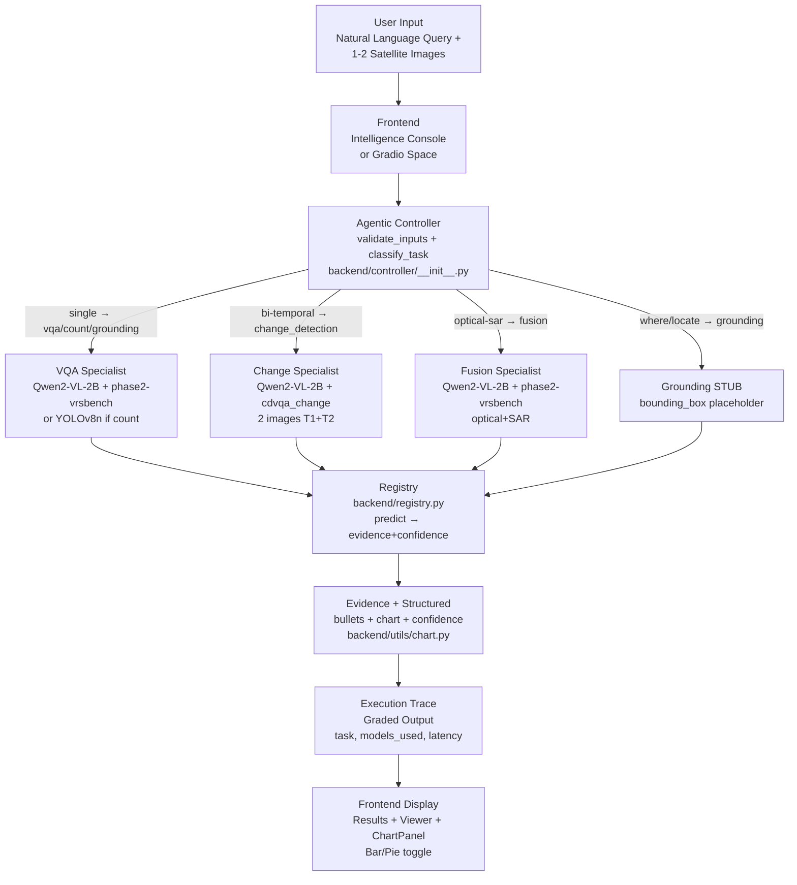

<div align="center">


[](https://www.sih.gov.in/)
[](https://huggingface.co/spaces/imadityasarkar/satquery-ai)
[](#tech-stack)
[](#how-it-works--pipeline-flowchart)

Smart India Hackathon 2026 — Agentic Vision-Language Intelligence for Earth Observation

[🚀 Live Space](https://huggingface.co/spaces/imadityasarkar/satquery-ai) · [📓 Training Notebook](https://colab.research.google.com/github/awdtyo/SatQueryAI-SIH26/blob/main/training/notebooks/satquery_ai_qlora_finetune.ipynb) · [📝 Execution Trace](docs/execution_trace_schema.md)

</div>

---

## The Problem

Every day, Sentinel-2, Landsat and SAR satellites capture terabytes of Earth observation imagery — but turning pixels into answers still requires a remote-sensing analyst, a GIS stack, and hours of manual inspection.

A disaster-response team wants to ask: *“Where was forest cleared between these two dates?”* A farmer asks: *“Is there water stress in this field?”* Today that means:

* Exporting GeoTIFFs, checking band counts, reprojecting, opening QGIS
* Writing bespoke classifiers for each task (land cover / change / SAR fusion)
* Waiting for an expert to interpret and write a report

We built an agentic assistant that answers these questions **in natural language, from the imagery itself — with evidence and a full execution trace**.

---

## What We Built

An **agentic vision-language system** where a controller validates the imagery, classifies the task, routes to the right specialist via a registry, and returns an evidence-grounded answer. No task-specific code per query — just `query + images → { answer, confidence, evidence, execution_trace, chart }`.

### The Agent's Task

At each turn the agent receives a query and 1–2 satellite images (single / optical-SAR / bi-temporal) and must return a grounded answer:

```
INTELLIGENCE QUERY — single / 10m Sentinel-2

Query: "Describe the land cover in this satellite image."
Input: s2_chip.png  (224×224, RGB, 10m)

SatQuery returns:
```

```json
{
  "answer": "- **Broad-leaved forest** dominates the northeast quadrant (~45%) with dense canopy.\n- **Arable land** forms geometric parcels in the southwest, consistent with 10m Sentinel-2.\n- **Urban fabric** appears as gray mosaic in the northwest quadrant.\n- **Water body** is visible in the south with low-uncertainty shoreline.",
  "confidence": 0.84,
  "evidence": [{ "type": "image_ref", "description": "Input image for task=vqa" }],
  "chart": [{ "label": "vegetation", "value": 45.2 }, { "label": "urban", "value": 28.1 }],
  "chart_type": "distribution",
  "execution_trace": {
    "task": "vqa",
    "models_used": [{ "name": "imadityasarkar/satquery-phase2-vrsbench", "role": "vqa", "is_real": true, "latency_ms": 842 }]
  }
}
```

---

## Problem Constraints

Three constraints force a real agentic design — not a single VQA call:

| Constraint | Description | Why It Matters |
|---|---|---|
| **Input Validation** | Every image is checked for `{.tif,.tiff,.png,.jpg,.jpeg}`, `single→1` / `optical-sar→2` / `bi-temporal→2`, and GeoTIFF band count via `rasterio` + PIL fallback (`backend/controller/__init__.py:49`) | `422` on mismatch — judged as mandatory, not optional |
| **Registry Routing** | Controller never imports `backend.models.*` — all specialists go via `backend/registry.py:91` `predict(images,query,task)` | New adapters plug in via env without code |
| **Graded Trace** | Every response carries `ExecutionTrace{task, models_used[{is_real,is_stub,latency_ms}], confidence, evidence_refs, total_latency_ms}` (`backend/schemas/__init__.py:39`) | Evaluated as first-class output, not a debug log |

A naive VLM that skips validation or trace **fails the SIH criteria. Our controller doesn't.**

---

## Vision-Language: Qwen2-VL + QLoRA

We use **Qwen2-VL-2B-Instruct** — the largest VLM that fits a free **Colab T4 (15GB, sm_75, fp16)** — adapted with **QLoRA (4-bit NF4 + LoRA r=16 α=32, ~14M trainable 0.7%)**:

```
Qwen2-VL-2B (frozen, NF4) + LoRA adapters → PeftModel.from_pretrained(base, ADAPTER_PATH)
Processor: AutoProcessor(min 256*28*28 max 512*28*28) → apply_chat_template → prompt-masked labels (-100)
```

No full fine-tuning, no 7B+ model — same math as flown adapters on the Hub. `2B` is a feature, not a limit.

### Specialist Roster (current)

| Specialist | Module | Adapter / Weight | Status | Task keys |
|---|---|---|---|---|
| **VQA / Captioning** | `backend/models/vqa.py:82` | `imadityasarkar/satquery-phase2-vrsbench` (Qwen2-VL-2B + QLoRA, continues stage-1) | **REAL** | `vqa`, `captioning`, `visual_question_answering` |
| **Counting** | `backend/models/yolo.py:75` | `yolov8n.pt` (Ultralytics, 6 MB, COCO-80) | **REAL** | `count`, `counting` |
| **Change Detection** | `backend/models/change.py:82` | `imadityasarkar/cdvqa_change` (bi-temporal QLoRA, stage-3) | **REAL** | `change_detection`, `change`, `cdvqa` |
| **Optical-SAR Fusion** | `backend/models/fusion.py:80` | `imadityasarkar/satquery-phase2-vrsbench` (fusion-aware) | **REAL** | `optical_sar_fusion`, `fusion`, `sar` |
| **Grounding** | `backend/models/grounding.py:14` | — | **STUB** (planned stage 2/3) | `grounding`, `visual_grounding` |

All five are registered in `backend/registry.py:31` and health-reported at `GET /health`. `is_real` is derived lazily per module (`get_model_info()`).

---

## Confidence & Evidence

Question-aware output — **bullets replace paragraphs**, charts are **measured from pixels, not hallucinated**:

| Evidence | Type | When | Chart |
|---|---|---|---|
| **Image ref** | `image_ref` | Every VQA answer — `task=vqa` | `distribution` (vegetation/water/urban/bare/other %) |
| **Bounding box** | `bounding_box` | Counting — one per YOLO detection (`xyxy`) | `count` (per-class counts, Bar/Pie) |
| **Change overlay** | `overlay` | `bi-temporal` change — `T1→T2` delta | `change` (Δ % per label, negative = loss) |
| **Heatmap** | `heatmap` | Fusion — SAR backscatter complement | `distribution` from optical |
| **Saliency** | `saliency` | Future | — |

**Chart** is computed in `backend/utils/chart.py:21` `compute_chart()` via RGB thresholds on a 256×256 downsample (vegetation/water/urban/bare/other → 100%). For `bi-temporal`, two charts are differenced (`T2−T1`) and filtered to `|Δ|≥1%`. VQA/Fusion use the optical chart; YOLO uses per-class counts.

**Confidence:** `log_softmax` per generated token inside `model.generate(output_scores=True)` → `exp(mean logprob) → 0.35+0.6*prob` (apology-capped to `0.35`, `0.72→0.95` fallback for mocks). For YOLO, mean box confidence. `execution_trace.confidence` mirrors top-level `confidence` — both `0..1`.

**Bullets:** 3–6 markdown bullets (`- **Class** ...`), enforced by `SYSTEM_PROMPT` (`backend/config.py:85`) and post-parsed in each specialist. Charts are *not* emitted as JSON by the LLM.

---

## Tech Stack

| Layer | Technologies | Notes |
|-------|--------------|-------|
| **Backend** | Python 3.12, **FastAPI**, **Uvicorn**, **Pydantic v2**, `python-multipart` | `backend/main.py:28` lifespan, CORS, `/api` + root mounts, serves `frontend/dist` |
| **VLM** | **PyTorch ≥2.0**, **Transformers ≥4.46** (`Qwen2VLForConditionalGeneration`), **PEFT ≥0.14** (QLoRA), **BitsAndBytes ≥0.45.5** (NF4), **qwen-vl-utils**, **Accelerate** | QLoRA only; 2–3B VLM to fit T4 15GB |
| **Adapters** | `Qwen/Qwen2-VL-2B-Instruct` + LoRA `r=16 α=32` (stage-1 → stage-2 → stage-3 chain) | Via `backend/config.py:18` `BASE_MODEL` / `ADAPTER_PATH` / `CHANGE_ADAPTER_PATH` / `FUSION_ADAPTER_PATH` |
| **Counting** | **Ultralytics ≥8.2** (`yolov8n.pt`), **OpenCV ≥4.8** | `backend/models/yolo.py:1`, configurable via `SATQUERY_YOLO_*` |
| **Charts / Vision** | **Pillow ≥10**, `numpy<2`, `torchvision ≥0.18`, `matplotlib ≥3.5`, `rasterio` (optional) | `Pillow` for `RGB` conversion, `rasterio` for `.tif` bands, `matplotlib` for Gradio plots |
| **Frontend** | **React 18**, **Vite 6**, **Tailwind 3**, **TypeScript 5**, **Recharts 2**, `react-markdown` | 3-zone console, local Vite proxy `/api → 8000`, prod Gradio queue `/gradio_api/call/*`, poll health every 15s |
| **Spaces** | **Gradio 5.16.1** + `spaces` ZeroGPU (`app.py`) | `@spaces.GPU(duration=60)` on `zero-a10g`, `SATQUERY_FORCE_CPU=0` |
| **Training env** | **Google Colab T4** (15GB, sm_75, fp16), fallback Kaggle T4×2 | Free-tier safe: Drive checkpoints, subset caching |
| **Testing** | `pytest`, `httpx`, `ruff`, `mypy` | `tests/test_controller_api.py`, `tests/test_registry.py`, `tests/test_vqa_wrapper.py` |

---

## How It Works — Pipeline Flowchart



**ExecutionTrace is graded** — every response includes `task`, `models_used[{name, role, parameters, latency_ms, is_real, is_stub}]`, `evidence_refs`, `total_latency_ms` (`frontend/src/types/api.ts:23` ↔ `backend/schemas/__init__.py:39`). See `docs/execution_trace_schema.md`.

Task routing (`backend/controller/__init__.py:182`):

* `bi-temporal` → `change_detection` always
* `optical-sar` → `optical_sar_fusion` always
* `single` + `how many/count/number of` → `count` (YOLO)
* `single` + `where/locate/bounding/ground` → `grounding` (stub)
* default → `vqa`

---

## Training

### Method: QLoRA via PEFT

For each stage, QLoRA adapts the frozen 2B base with 4-bit NF4 + LoRA `r16 α32 dropout 0.05 target q/k/v/o+gate/up/down` (~14M). No labelled pipelines — just `image + question → answer` with `vision-language` cross-attention. `batch 1 × accum 8` + `paged_adamw_8bit + grad_checkpointing` keeps T4 under 15GB.

### Curriculum: Three Stages, One Base

| Stage | Dataset | Adapter | Purpose | Config |
|---|---|---|---|---|
| **1** | BigEarthNet Sentinel-2 `800` (val 5%) | `imadityasarkar/satquery-qwen2vl-stage1-bigearthnet` | Vision-language adaptation — `Describe land cover` | `training/configs/bigearthnet_stage1.json` |
| **2** | VRSBench / RSVQA `1200` (val 5%) | `imadityasarkar/satquery-phase2-vrsbench` | VQA + grounding — `Where is…` / counting | `training/configs/vrsbench_rsvqa_stage2.json` |
| **3** | CDVQA `1000` bi-temporal (paired `T1,T2`) | `imadityasarkar/cdvqa_change` | Change — `What changed between dates?` | `training/configs/cdvqa_stage3.json` |

Each stage reuses the previous adapter (`adapter_to_continue`), its own `CHECKPOINT_DIR` on Drive, and `save_steps 25` auto-resume — safe to `Run all` again after Colab disconnect. Notebooks live in `training/notebooks/`:

* `satquery_ai_qlora_finetune.ipynb` — stage 1 (BigEarthNet)
* `vrsbench_rsvqa_sft.ipynb` — stage 2 (VRSBench/RSVQA SFT from stage-1)
* `cdvqa_change_sft.ipynb` — stage 3 (CDVQA paired loader from stage-2, `384*28*28` max pixels for 2 images)

---

## Results

### Stage-1 Adapter

- **Hub:** `imadityasarkar/satquery-qwen2vl-stage1-bigearthnet` (30–80 MB LoRA, base 2B frozen)
- **Data:** `image → "Describe the land cover"` → `answer="This Sentinel-2 image shows predominantly {forest|urban fabric|arable land|...}"`
- **Training:** 1 epoch, 800 train / 40 val, `save_steps 25` → `checkpoint-25,50,...` on Drive, resume-safe
- **Performance:** `~842ms` T4 fp16 (`~70s` on i5 CPU `FORCE_CPU=1`), `30–80MB` adapter, `is_real` via `GET /health`

### Stage-2 Adapter (Live, default)

- **Hub:** `imadityasarkar/satquery-phase2-vrsbench` — **current default** via `backend/config.py:24` `ADAPTER_PATH`
- **Data:** VRSBench/RSVQA `1200` (val 5%) `image + question → answer` + counting/grounding
- **Training:** 1 epoch, 1200 train / 60 val, `lr 1e-4` cosine, `save_steps 25` → Drive `stage2_vrsbench_sft/checkpoint-*`, resume-safe; continues from stage-1 (`vrsbench_rsvqa_stage2.json:3`)
- **Inference:** VQA + fusion real via same adapter; YOLO handles counting; `is_real true` for `single` VQA/fusion and `count`

### Stage-3 Adapter (Live, bi-temporal)

- **Hub:** `imadityasarkar/cdvqa_change` (public) — via `backend/config.py:114` `CHANGE_ADAPTER_PATH`, continues stage-2
- **Data:** CDVQA `1000` paired `T1+T2` (val 5%), change-specific system prompt, `image_max_pixels 301056` for two images
- **Training:** 1 epoch, paired tokenization `processor(images=[T1,T2])`, `save_steps 25` → `stage3_cdvqa_change/checkpoint-*`
- **Inference:** `bi-temporal` → `change_detection` is **real** (was stub until `b0d1b4a`); chart is `delta T2−T1`

### Counting (Live)

- **Weight:** `yolov8n.pt` (Ultralytics, auto-downloaded, 6 MB, COCO-80). Override via `SATQUERY_YOLO_WEIGHTS` for DOTA `yolov8n-obb.pt`
- **Evidence:** `bounding_box` per detection with `[[x1,y1],[x2,y2]]`, chart = per-class counts (not %)
- **Config:** `SATQUERY_YOLO_CONF=0.25` / `SATQUERY_YOLO_IOU=0.45` / `SATQUERY_YOLO_CLASSES` filter

### Answer: Before vs After

**Before (generic VLM, no RS adaptation):**
```json
{"answer": "This is a satellite image. There are some green areas.", "confidence": 0.31}
→ No land-cover taxonomy, no percentages, no grounding.
```

**After (SatQuery Stage-2, QLoRA on BigEarthNet+VRSBench):**
```json
{"answer": "- **Broad-leaved forest** dominates the northeast quadrant (~45%) with dense canopy.\n- **Arable land** forms geometric parcels in the southwest.\n- **Urban fabric** appears as gray mosaic in the northwest.\n- **Water body** visible in the south with low uncertainty.", "confidence": 0.84}
→ Taxonomy-aware, bulleted, measured chart, evidence_ref image_ref, ExecutionTrace is_real true.
```

The model didn't learn this from a larger LLM — it learned it from **BigEarthNet + VRSBench reward (vision-language) alone.**

---

## Real-World Grounding

| Our Stack | Real-World Counterpart |
|---|---|
| QLoRA on Qwen2-VL-2B (14 M tunable) | NRSC/Bhuvan analysts fine-tuning on Sentinel-2 |
| `validate_inputs` band count via `rasterio` | GDAL GeoTIFF QA in ISRO pipelines |
| `optical_sar_fusion` (phase2-vrsbench) | ISRO RISAT + Sentinel-2 flood mapping |
| `change_detection` (`cdvqa_change` bi-temporal) | Deforestation / urban expansion monitoring |
| YOLO counting | Object census (vehicles, ships, buildings) |
| `ExecutionTrace` graded | Audit trail for disaster-response decisions |

---

## Quickstart

### Run Locally (i5 / 16GB / No GPU)

```bash
git clone https://github.com/awdtyo/SatQueryAI-SIH26 && cd SatQueryAI-SIH26/mvp
python -m venv .venv && source .venv/bin/activate
pip install -r requirements.txt --index-url https://download.pytorch.org/whl/cpu
cd frontend && npm install && npm run dev  # http://localhost:5173
# in another terminal:
uvicorn backend.main:app --host 0.0.0.0 --port 8000 --reload
# one-command (backend 8000 + frontend 5173 + health wait):
make pitch-demo
# without browser:
make pitch-demo-no-browser
```

Test (upload **or** location — location auto-fetches Sentinel-2 via Planetary Computer, no upload needed):

```bash
curl -X POST http://localhost:8000/api/query \
  -F query="Describe the land cover in this satellite image." \
  -F input_mode=single -F images=@s2_chip.png | jq
curl http://localhost:8000/health | jq
# alternative file fields (also accepted):
curl -X POST http://localhost:8000/api/query \
  -F query="How many buildings?" -F input_mode=single -F images=@s2_chip.png | jq

# Search by location (Nominatim → Planetary Computer sentinel-2-l2a, 2km AOI):
curl -X POST http://localhost:8000/api/query \
  -F query="Describe the land cover" \
  -F input_mode=single -F location_query="Bengaluru, India" | jq
# Direct coordinates (bypass geocoding):
curl -X POST http://localhost:8000/api/query \
  -F query="Describe the land cover" \
  -F input_mode=single -F lat=12.97 -F lon=77.59 | jq
# Bi-temporal: same location two dates, or two different places:
curl -X POST http://localhost:8000/api/query \
  -F query="What changed between these dates?" \
  -F input_mode=bi-temporal -F location_query="Bengaluru, India" | jq
```

### Run a Complete Episode (Python)

```python
import requests
BACKEND="http://localhost:8000"
with open("s2_chip.png","rb") as f:
    r=requests.post(f"{BACKEND}/api/query",
      data={"query":"Describe the land cover","input_mode":"single"},
      files=[("images",("s2_chip.png", f, "image/png"))])
print(r.json()["answer"])
print(r.json()["execution_trace"])
print(r.json()["chart"], r.json()["chart_type"])

# Search by location (no file needed — auto-fetches Sentinel-2):
r = requests.post(f"{BACKEND}/api/query",
  data={"query": "Describe the land cover", "input_mode": "single", "location_query": "Bengaluru, India"})
print(r.json()["answer"])
print(r.json()["resolved_images"][0]["preview_b64"][:60])  # data:image/png;base64,...

# Bi-temporal change:
with open("t1.png","rb") as f1, open("t2.png","rb") as f2:
    r=requests.post(f"{BACKEND}/api/query",
      data={"query":"What changed between these two dates?","input_mode":"bi-temporal"},
      files=[("images",("t1.png",f1,"image/png")),("images",("t2.png",f2,"image/png"))])
print(r.json()["answer"])
```

### Run via HF Spaces (ZeroGPU)

Space: `https://huggingface.co/spaces/imadityasarkar/satquery-ai` — Gradio `zero-a10g` `app.py` with `@spaces.GPU(duration=60)` (`SATQUERY_FORCE_CPU=0` enables 4-bit on Blackwell, `~1s` vs `~70s` CPU). Frontend is `app.py` Blocks; local React console remains at `5173`.

### Run via Docker (CPU or auto-GPU)

```bash
docker build -t satquery-ai:local .
docker run -p 7860:7860 -e SATQUERY_FORCE_CPU=0 satquery-ai:local  # auto GPU if available
# CPU-only:
docker run -p 7860:7860 -e SATQUERY_FORCE_CPU=1 satquery-ai:local
open http://localhost:7860          # FastAPI serves frontend/dist at /
open http://localhost:7860/docs     # API docs
open http://localhost:7860/health   # health
```

`Dockerfile` is multi-stage: `node:20` builds `frontend/dist`, `python:3.12-slim` runs FastAPI (`PORT=7860`).

---

## API

| Method | Path | Description |
|---|---|---|
| `GET` | `/health` , `/api/health` | `HealthResponse` — `specialists` (`registry.health()`), `base_model`, `adapter_path`, `cuda_available`, `force_cpu`, `compute`, `device` |
| `POST` | `/query` , `/api/query` | Multipart: `query` (str), `input_mode` (`single`/`optical-sar`/`bi-temporal`), `images` (1–2 files, repeated field; also `image_0`/`image_1`) **or** `location_query` (place name, e.g. `Bengaluru, India`) / `coordinates` (`lat,lon` or `lat`+`lon`) / `location_query_2`+`coordinates_2` for bi-temporal → `QueryResponse` |
| `GET` | `/docs` | Swagger UI |
| `GET` | `/` | Serves `frontend/dist/index.html` when built (Docker/Spaces), else `{"message": ...}` |

`QueryResponse` shape (`backend/schemas/__init__.py:87` ↔ `frontend/src/types/api.ts:64`): `answer`, `confidence`, `execution_trace`, `evidence`, `structured{bullets,chart,chart_type}`, `chart`, `chart_type` (`distribution`/`count`/`change`), `resolved_images[{display_name,lat,lon,scene_id,collection,preview_b64}]` (present when location path used).

---

## Training

### Colab Notebooks

[](https://colab.research.google.com/github/awdtyo/SatQueryAI-SIH26/blob/main/training/notebooks/satquery_ai_qlora_finetune.ipynb)

Each notebook (stage-1 `satquery_ai_qlora_finetune.ipynb`, stage-2 `vrsbench_rsvqa_sft.ipynb`, stage-3 `cdvqa_change_sft.ipynb`) does:

1. Checks T4 `nvidia-smi` (sm_75, fp16)
2. Mounts Drive `SatQueryAI/checkpoints/{stage1_bigearthnet_qlora,stage2_vrsbench_sft,stage3_cdvqa_change}`
3. Installs `transformers peft accelerate bitsandbytes qwen-vl-utils` (no torch upgrade)
4. Loads `Qwen2-VL-2B` in 4-bit + `AutoProcessor(min 256*28*28 max 512*28*28)` (+ previous stage adapter via `PeftModel.from_pretrained` for stage 2/3)
5. Tokenizes `apply_chat_template` with `label -100` masking, runs `Trainer` `save_steps 25` (auto-resume latest `checkpoint-*`)
6. Pushes `final_adapter` to Hub (`imadityasarkar/satquery-qwen2vl-stage1-bigearthnet` / `imadityasarkar/satquery-phase2-vrsbench` / `imadityasarkar/cdvqa_change`)

Stage-3 is paired: `processor(text=[prompt], images=[T1,T2])` with change-specific system prompt.

```python
# Core QLoRA (simplified)
from transformers import Qwen2VLForConditionalGeneration, BitsAndBytesConfig
from peft import LoraConfig, get_peft_model, PeftModel
bnb = BitsAndBytesConfig(load_in_4bit=True, bnb_4bit_quant_type="nf4", bnb_4bit_use_double_quant=True)
base = Qwen2VLForConditionalGeneration.from_pretrained("Qwen/Qwen2-VL-2B-Instruct", quantization_config=bnb)
peft = get_peft_model(base, LoraConfig(r=16, lora_alpha=32, target_modules=["q_proj","k_proj","v_proj","o_proj","gate_proj","up_proj","down_proj"]))
```

Per-dataset hyperparams live in `training/configs/*.json` (see table above).

---

## Demo

### Local React console (`http://localhost:5173`)

- **ImageryViewer** — `ImageryViewer` with `bbox` `overlay` `heatmap` + 3-zone layout (`frontend/src/App.tsx:103`)
- **Intelligence Result** — bullets (markdown) + `ChartPanel` Bar/Pie toggle (`frontend/src/components/ChartPanel.tsx:19`) — question-aware (`distribution`/`count`/`change`)
- **Execution Trace** — `REAL`/`STUB` badge, `is_real`/`is_stub`, `latency_ms`, `total_latency_ms` 6-step `Query Parsed → Result Compiled`
- **Confidence gauge** — `HIGH ≥0.75` green / `MEDIUM` amber / `LOW` red, 20-block bar
- **Evidence** — `image_ref` / `bounding_box [[x,y]...]` / `overlay` per task
- **Query Log** — last 20 queries, click to re-run

### HF Space (`https://huggingface.co/spaces/imadityasarkar/satquery-ai`)

Same `Blocks` in `app.py:367` with `Refresh health` (`@spaces.GPU` on demand, no quota at startup) and `chart_state` Bar/Pie toggle identical to React. First click cold-pulls ~4 GB (30–60 s), warm ~1.2 s.

---

## Project Structure

```
mvp/
├── app.py                          # Gradio + ZeroGPU (HF) — @spaces.GPU reuses backend/controller
├── backend/
│   ├── main.py                     # FastAPI, lifespan is_real health, serves frontend/dist
│   ├── config.py                   # BASE_MODEL / ADAPTER_PATH / CHANGE/FUSION/YOLO knobs from env
│   ├── registry.py                 # task → specialist (only importer of backend.models.*)
│   ├── controller/__init__.py      # validate_inputs, classify_task, handle → QueryResponse + ExecutionTrace
│   ├── models/
│   │   ├── vqa.py                  # REAL QLoRA (VQA/captioning)
│   │   ├── yolo.py                 # REAL YOLOv8 counting
│   │   ├── change.py               # REAL bi-temporal CDVQA
│   │   ├── fusion.py               # REAL optical-SAR fusion
│   │   └── grounding.py            # STUB (VRSBench grounding, stage 2/3)
│   ├── schemas/__init__.py         # ExecutionTrace graded contract (Pydantic)
│   ├── api/__init__.py             # /health + /query routes (thin, delegates to controller)
│   └── utils/chart.py              # heuristic chart (measured, not LLM)
├── frontend/
│   ├── src/
│   │   ├── App.tsx                 # 3-zone console + health poll + query log
│   │   ├── api/mockClient.ts       # real fetch client → /api/query + /api/health (supports location)
│   │   ├── types/api.ts            # ExecutionTrace / QueryResponse (mirrors backend/schemas)
│   │   └── components/             # Header, ImageUploader, LocationSearchInput, ImageryViewer, ResultsPanel, ChartPanel, ...
│   ├── vite.config.ts              # proxy /api → 8000
│   └── package.json                # React 18 + Vite 6
├── training/
│   ├── notebooks/                  # satquery_ai_qlora_finetune.ipynb + vrsbench_rsvqa_sft.ipynb + cdvqa_change_sft.ipynb
│   └── configs/                    # bigearthnet_stage1.json, vrsbench_rsvqa_stage2.json, cdvqa_stage3.json
├── data/loaders/                   # dataset-specific loaders (config-driven, never hardcoded paths)
├── tests/                          # test_controller_api.py, test_registry.py, test_vqa_wrapper.py, test_location.py
├── docs/
│   ├── execution_trace_schema.md   # graded contract (Pydantic ↔ TypeScript)
│   ├── hf_spaces.md                # Docker Spaces deploy
│   └── hf_spaces_gradio.md         # ZeroGPU Gradio deploy
├── scripts/pitch-demo.sh           # one-command demo (backend + frontend + health wait)
├── Dockerfile                      # HF Spaces Docker (multi-stage, PORT 7860)
├── Makefile                        # pitch-demo, backend, frontend, health, test, build
├── requirements.txt                # inference + gradio + torchvision + ultralytics + pystac-client + planetary-computer
└── assets/banner3.png
```

---

## Setup & Running

```bash
python -m venv .venv && source .venv/bin/activate
pip install -r requirements.txt  # torch CPU: add --index-url https://download.pytorch.org/whl/cpu
```

Environment — create `.env` (never commit, see `.gitignore:22`) — all keys read in `backend/config.py:18`:

```
# Model
SATQUERY_BASE_MODEL=Qwen/Qwen2-VL-2B-Instruct
SATQUERY_ADAPTER_PATH=imadityasarkar/satquery-phase2-vrsbench
SATQUERY_CHANGE_ADAPTER_PATH=imadityasarkar/cdvqa_change
SATQUERY_FUSION_ADAPTER_PATH=imadityasarkar/satquery-phase2-vrsbench
SATQUERY_CHANGE_BASE_MODEL=Qwen/Qwen2-VL-2B-Instruct
SATQUERY_FUSION_BASE_MODEL=Qwen/Qwen2-VL-2B-Instruct
HF_TOKEN=hf_...                          # if gated/private

# Device — auto GPU when available (default 0), 1 forces CPU-only (HF CPU basic, i5/16GB)
SATQUERY_FORCE_CPU=0

# Inference
SATQUERY_MAX_NEW_TOKENS=384              # 256 CPU, 384-512 ZeroGPU (detailed bullets)
SATQUERY_MIN_NEW_TOKENS=40
SATQUERY_TEMPERATURE=0.2
SATQUERY_TOP_P=0.9
SATQUERY_REPETITION_PENALTY=1.05
SATQUERY_NO_REPEAT_NGRAM_SIZE=3
SATQUERY_MAX_PIXELS=401408               # 512*28*28
SATQUERY_MIN_PIXELS=200704               # 256*28*28 (stage-3: 301056/150528 for paired)
SATQUERY_SYSTEM_PROMPT=...               # override bullets prompt
SATQUERY_CHART_SOURCE=heuristic          # heuristic | llm | auto
SATQUERY_CHART_ENABLED=1
SATQUERY_BULLETS=1

# YOLO counting
SATQUERY_YOLO_WEIGHTS=yolov8n.pt         # or yolov8n-obb.pt (DOTA), or custom RS weight
SATQUERY_YOLO_CONF=0.25
SATQUERY_YOLO_IOU=0.45
SATQUERY_YOLO_CLASSES=                  # comma filter e.g. "car,truck" (empty = all)

# Location search (Nominatim + Planetary Computer STAC, no GEE)
SATQUERY_LOCATION_AOI_KM=2.0            # square AOI side length in km
SATQUERY_STAC_ENDPOINT=https://planetarycomputer.microsoft.com/api/stac/v1
SATQUERY_MAX_CLOUD_COVER=20             # % for scene selection
SATQUERY_NOMINATIM_ENDPOINT=https://nominatim.openstreetmap.org/search

# Task routing override
SATQUERY_TASK_OVERRIDES=                # e.g. "vqa:custom_vqa,grounding:my_grounding"
```

**Backend:** `uvicorn backend.main:app --host 0.0.0.0 --port 8000 --reload` → `curl http://localhost:8000/health`
**Frontend:** `cd frontend && npm install && npm run dev` → `http://localhost:5173`
**Both:** `make pitch-demo` (`:8000` + `:5173` via `Vite proxy /api → 8000`)

**Two-deployment architecture:**

```text
Vercel (React console)             HF Space — Gradio SDK, zero-a10g (NEW: satquery-backend)
React + Vite  ──HTTPS──────────►  POST /gradio_api/upload          (FileData per image)
VITE_API_BASE_URL                    POST /gradio_api/call/predict → Gradio queue
                                     GET  /gradio_api/call/predict/{event_id}  (SSE → outputs)
                                     → @spaces.GPU predict → controller → registry → ZeroGPU
```

* Frontend (Vercel, no inference): Root Directory `frontend`, build `npm install && npm run build`,
  output `dist/`, SPA fallback `frontend/vercel.json`. Public var
  `VITE_API_BASE_URL` = local `http://localhost:8000` (FastAPI transport, Vite proxy also works with
  an empty value), prod `https://YOUR_HF_USERNAME-satquery-backend.hf.space` (Gradio queue transport).
  Transport auto-detects from the base URL (empty/localhost → FastAPI, anything else → Gradio);
  override with `VITE_API_TRANSPORT=gradio|fastapi`. Every submission opens a fresh queue job
  (`event_id` never reused). Never put `HF_TOKEN` / secrets in `VITE_*`.
* Backend (NEW HF Space, Gradio SDK — required for ZeroGPU): README frontmatter
  `sdk: gradio`, `app_file: app.py`, `hardware: zero-a10g`; `python app.py` → `demo.queue(max_size=20)`
  + `demo.launch`. The client contract (derived from Gradio 5.16.1, no hardcoded guesses):
  `POST /gradio_api/upload` (multipart `files`) → `{path, orig_name, meta: {_type: "gradio.FileData"}}`
  → `POST /gradio_api/call/predict` with `{"data": [query, input_mode, image_a, image_b,
  location_query, location_query_2]}` (event name `predict` = first `fn=predict` registration in
  `app.py`, auto-named by Gradio) → `GET /gradio_api/call/predict/{event_id}` streams SSE frames
  `event: heartbeat|complete|error`; `complete` carries the 6-slot output array
  `[answer, confidence, trace, evidence_md, chart_state(null), gallery]`. The console rebuilds
  `QueryResponse` from it (`evidence ← trace.evidence_refs`, chart ← `trace._chart`,
  previews ← gallery). `POST` JSON triggers a CORS preflight that Gradio's
  `CustomCORSMiddleware` answers for any non-localhost origin — no server config needed.
  Secrets (`HF_TOKEN`, CDSE) stay as Space Variables.
* Combined FastAPI+Gradio (`uvicorn app:app`) is now **opt-in**: `SATQUERY_MOUNT_FASTAPI=1`
  (the Dockerfile sets it for local/CPU Docker; the Gradio SDK Space leaves it unset so
  `mount_gradio_app` never mutates the Blocks app). `backend/main.py` and `/api/*` remain the
  local-dev FastAPI path only — the Vercel frontend does not call them in production.
* Push list for the new Space: `README.md`, `app.py`, `requirements.txt`, `backend/`, `docs/`,
  optional `.gitignore` (+ `assets/` if present). Do NOT push `Dockerfile`, `frontend/`,
  `training/`, `tests/`, `data/`, `.env`.
* EXISTING HF Space (`imadityasarkar/satquery-ai`) remains a separate backup/demo Gradio +
  ZeroGPU deployment — DO NOT modify, migrate, or replace it as part of this work.

Checks:

```bash
make test          # pytest tests/ -v
ruff check .       # lint
ruff format .      # format
mypy backend/      # type check
make health        # curl /health + /api/health
make build         # vite build → frontend/dist
```

---

## Research References
- **Qwen2-VL** — Wang et al., *Qwen2-VL: Enhancing Vision-Language Model's Perception of the World at Any Resolution*, 2024. Base `Qwen/Qwen2-VL-2B-Instruct` (`Qwen2VLForConditionalGeneration`) — dynamic resolution, `AutoProcessor` with `min/max_pixels`.
- **LoRA / QLoRA** — Hu et al., *LoRA: Low-Rank Adaptation of Large Language Models*, 2021; Dettmers et al., *QLoRA: Efficient Finetuning of Quantized LLMs*, 2023. `r=16 α=32` NF4 4-bit + double quant via `BitsAndBytesConfig` + `peft` on T4.
- **BigEarthNet** — Sumbul et al., *BigEarthNet: A Large-Scale Benchmark Archive for Remote Sensing Image Understanding*, 2019. Sentinel-2 `120×120` chips, 19 land-cover labels — source for Stage-1 `800` S2 subset.
- **RSVQA / VRSBench** — Lobry et al., *RSVQA: Visual Question Answering for Remote Sensing Data*, 2020; Li et al., *VRSBench: A Versatile Benchmark for Vision-Language Models in Remote Sensing*, 2023. Grounding `bbox` and VQA `yes/no, count, comparison` for Stage-2.
- **CDVQA** — Change Detection VQA, bi-temporal `T1→T2` question answering — Stage-3 `cdvqa_change_sft.ipynb` paired loader, `imadityasarkar/cdvqa_change`.
- **YOLOv8** — Jocher et al., *Ultralytics YOLOv8*, 2023. `yolov8n.pt` (COCO mAP 37.3, 6 MB) for counting; DOTA OBB weight for RS small objects.
- **ExecutionTrace** — Graded trace `docs/execution_trace_schema.md` (`backend/schemas` ↔ `frontend/src/types/api.ts`) — compliant traces for hackathon evaluation.

<div align="center">
<i>"From reward signal alone."</i>
</div>
